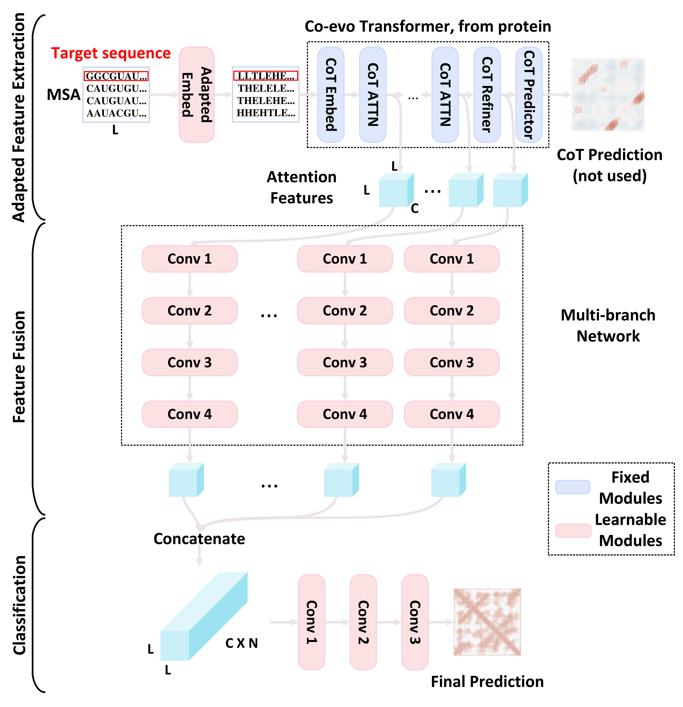

## Knowledge from Large-Scale Protein Contact Prediction Models can be Transferred to the Data-Scarce RNA Contact Prediction Task
This is a joint work by [Yiren Jian](https://cs.dartmouth.edu/~yirenjian/), [Chongyang Gao](https://gcyzsl.github.io/), [Chen Zeng](https://physics.columbian.gwu.edu/chen-zeng), [Yunjie Zhao](http://zhaoserver.com.cn/index.html) and [Soroush Vosoughi](https://www.cs.dartmouth.edu/~soroush/). The **[paper](https://arxiv.org/abs/2302.06120)** is under review.



## Requirements

In this repo:
- We provide the script and model for running inference (testing). Any machines with a CPU and an Ubuntu system should work. The GPU is not required for inference.
- We also provide code and instructions for training models. A GPU is required for training.

We recommend using Anaconda to create a virtual environment for this project. Assuming you have [Anaconda](https://www.anaconda.com/) installed (then skip the following two commands), or you can do
```bash
wget https://repo.anaconda.com/archive/Anaconda3-2021.05-Linux-x86_64.sh
bash Anaconda3-2021.05-Linux-x86_64.sh
```

After that, you will need two major software packages: `pytorch` and `pydca`. The following commands will create a virtual environment and install the necessary packages. Note that we install the GPU version of PyTorch (`torch==1.8.1+cu11`) for training purpose.

```bash
conda create -n pytorch-1.8 python=3.7
conda activate pytorch-1.8
pip install tqdm
pip install torch==1.8.1+cu111 torchvision==0.9.1+cu111 torchaudio==0.8.1 -f https://download.pytorch.org/whl/torch_stable.html
pip install pydca
pip install tensorboard
```

Finally, clone (download) this repository to your local machine
```bash
git clone https://github.com/yiren-jian/CoT-RNA-Transfer.git
cd CoT-RNA-Transfer
```

## Inference using our pre-trained model

Here we provide an example of using our pretrained model for inference. The input is a RNA MSA (see [examples](RNA_TESTSET/MSA_pydca)) and the output is predicted contact scores.
```bash
python run_inference.py --input_MSA RNA_TESTSET/MSA_pydca/RF00001.faclean
```

The outputs are saved as `outputs/dist.txt` and `outputs/pred.txt`.

## Training our models

We use the [train/val](RNA_DATASET/) and [testing](RNA_TESTSET/) datasets from [coconet](https://github.com/KIT-MBS/coconet).

The training and evaluation scripts are released.
- [x] `preprocess_msa.py`
- [x] `preprocess_feat.py`
- [x] `train_val_transfer.py`
- [x] `eval_transfer.py`

You will first need to translate RNA MSA from nucleotide to amino acids. For example, from `AUCG` to `HETL`.
```bash
python preprocess_msa.py --AminoAcids "HETL"
```

Next, `preprocess_feats.py` will pre-extract CoT features from different layers (inputs to the transfer model) and ground truth RNA contacts from PDBs (as ground truth labels).
```bash
python preprocess_feats.py
```
This process can take about 30 minutes, outputting four pickle files.
```
RNA_DATASET_PDB_DATA.pickle
RNA_TESTSET_PDB_DATA.pickle
RNA_DATASET_PDB_FEATS.pickle
RNA_TESTSET_PDB_FEATS.pickle
```

The following script will train models (by searching hyper-parameters `EPOCH` and `BATCH_SIZE`) on the training set, pick the best model based on validation, and finally evaluate on the testing set.
```bash
for MIN_LR in 0.0
do
    for EPOCH in 100 300 500
    do
        for BATCH_SIZE in 4 8 12 16
        do
            CUDA_VISIBLE_DEVICES=0,1,2,3 python train_val_transfer.py --scheduler_type 'CosineLR' --min_lr $MIN_LR --batch_size $BATCH_SIZE --total_epoch $EPOCH --feature_list 0 1 2 3 4 5 6
        done
    done
done
```
or you can simply run `bash run_experiments.sh`. Note that our training supports multi-GPUs, i.e., you can use `CUDA_VISIBLE_DEVICES=0`, `CUDA_VISIBLE_DEVICES=0,1,2,3` or `CUDA_VISIBLE_DEVICES=0,1,2,3,4,5,6,7` depending on how many GPUs you have (want to use).

The trained models are saved in `saved_models/` and the training logs are stored in `tensorboard_dir/`. Check [this](https://stackoverflow.com/questions/37987839/how-can-i-run-tensorboard-on-a-remote-server) for how to visualize training/testing loss/curve on your local machine. Besides, training logs will also be printed in your terminal.

On our single RTX-A6000, training 500 epochs with batch 16 takes about 90 min and consumes about 20GB GPU memory. This should give a rough guideline on different hardware setups to run our experiments.

The trained models can be evaluated (e.g., change `MIN_LR`, `BSZ` and `EPOCH` to 0.0, 4, 500) by
```bash
python eval_transfer.py --model_path "saved_models/train_val/CosineLR-0.001-MIN_LR-BSZ-EPOCH.chk"
```

## License
Our work is built on two prior works [coevolution_transformer](https://github.com/microsoft/ProteinFolding/tree/main/coevolution_transformer) and [coconet](https://github.com/KIT-MBS/coconet), both are MIT licensed.

## Acknowlegements
We would like to thank authors of [coevolution_transformer](https://github.com/microsoft/ProteinFolding/tree/main/coevolution_transformer) for providing pre-trained protein CoT, and [coconet](https://github.com/KIT-MBS/coconet) for providing RNA datasets.

- Zhang, He, Fusong Ju, Jianwei Zhu, Liang He, Bin Shao, Nanning Zheng, and Tie-Yan Liu. "Co-evolution transformer for protein contact prediction." Advances in Neural Information Processing Systems 34 (2021): 14252-14263.
- Zerihun, Mehari B., Fabrizio Pucci, and Alexander Schug. "CoCoNet—boosting RNA contact prediction by convolutional neural networks." Nucleic acids research 49, no. 22 (2021): 12661-12672.

## Citation
If you find the paper/repo useful for your research, please consider citing our paper.

```bibtex
@misc{https://doi.org/10.48550/arxiv.2302.06120,
  doi = {10.48550/ARXIV.2302.06120},
  url = {https://arxiv.org/abs/2302.06120},
  author = {Jian, Yiren and Gao, Chongyang and Zeng, Chen and Zhao, Yunjie and Vosoughi, Soroush},
  keywords = {Quantitative Methods (q-bio.QM), Machine Learning (cs.LG), FOS: Biological sciences, FOS: Biological sciences, FOS: Computer and information sciences, FOS: Computer and information sciences},
  title = {Knowledge from Large-Scale Protein Contact Prediction Models Can Be Transferred to the Data-Scarce RNA Contact Prediction Task},
  publisher = {arXiv},
  year = {2023},
  copyright = {arXiv.org perpetual, non-exclusive license}
}
```
